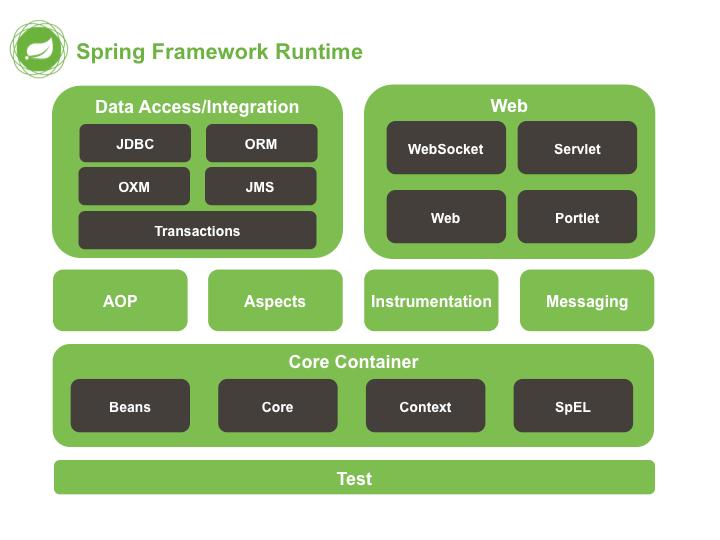
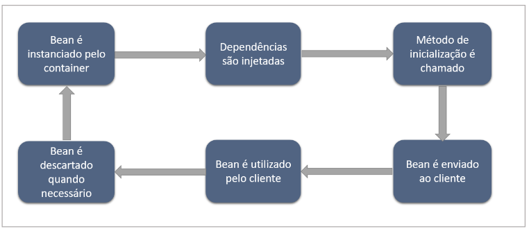

# Introdução
É um framework utilizado para desenvolvimento web em Java, ficou popular devido ser um ecossistema que preza pela produtividade, evitando que o programador desperdice tempo com configurações excessivas e possa focar nas regras de negócio da aplicação.
O ecossistema possui recursos suficientes para desenvolver uma aplicação, abrangindo várias áreas, desde a integração com o banco de dados, testes untários e de integração, cloud, autenticação etc.
## Spring Framework
É o projeto base do ecossistema, com ele podemos desenvolver a base da nossa aplicação e torna-la mais robusta com os módulos que derivam dele ex: Spring Security.
Sub dividido em 7 módulos:
+ Core Container
+ Data Access
+ Web
+ Aspects
+ Intrumentation
+ Messaging
+ Test

O grupo core está definido todas as classes básicas e avançadas, partes fundamentais do framework, além do controle das configurações que são executadas em tempo de execução: Annotations, arquivos xml.
Módulo **Data**  é responśavel por facilitar a comunicação com o banco de dados por meio de transações.
Módulo **Web** contém recursos para implementação da camada Web da aplicação, como Mvc, WebServices.
Módulo **Test** é responsável pela camada de Testes, fornece facilidade na hora de testar a aplicação.

## Inversão de Controle (IoC)
Inversão de Controle é o processo no qual o objeto define suas depedências sem cria-las, ou **seja delega a função de criar as instâncias das dependências para um contêiner IoC.**
Uma classe A que tem uma depedência B, e utiliza algum método de B, teria sempre que instanciar um novo objeto para B, quando fosse necessário usar o método de B.
Com a Inversão de Controle, a classe A não realiza essa instanciação, contudo informa ao contêiner do Springframework no qual realiza a inversão de controle, que a classe A necessita que a sua dependência(classe B ) seja injetada, é aí que entra o conceito de injeção de dependência. 
## Injeção de Dependências
É a implementação utilizada pelo Spring para aplicar a Inversão de Controle, consiste em definir as classes (dependências) que serão instanciadas  e a onde elas serão injetadas QUANDO houver necessidade.
A maneira mais efetiva é utilizar um ponto de injeção, dentro da classe A, temos um construtor passando como parâmetro a classe a ser injetada, de forma opcional podemos utilizar a notação @Autowired para **explicitar** a injeção de dependência no construtor, dessa forma a instanciação da classe B, é responsabilidade do contêiner IoC, que nosso caso é o módulo Core do framework.
## Core Container & Ciclo de vida
O spring utiliza a injeção de dependência para aplicar a inversão de controle na aplicação, toda essa configuração e o funcionamento está presente no Core Container, a base do framework.
**Aplicação iniciada**:
Core container inicia carregando as configurações pré definidas em classes ou arquivos xml, define as dependências e as cria através da Inversão de controle, são destruídas quando não mais utilizadas.
No contexto do Spring, tais dependências recebem o nome de **Beans**, objetos no qual possuem ciclo de vida gerenciado pelo container IoC do Spring.

## Beans
Objetos no qual são instanciados e monitorados pelo  contêiner do Spring IoC. Ele também tem um ciclo de vida que consiste em ser instanciado pelo contêiner, então as dependências dele são injetadas, após isso é chamado o seu método de inicialização e é enviado ao cliente, a classe que possui essa dependência, então ele é utilizado e quando não for mais necessário é desfeito.
### Configurando os Beans
O Spring precisa saber quais classes serão tratadas como beans, para poder gerencia-los. Utilizamos annotations para determinar o tipo de bean ex:
+ Component
+ Service
+ Repository
+ Controller
->[API REST & RESTful](API%20REST%20&%20RESTful.md)